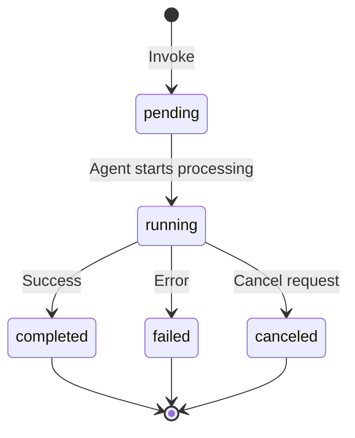
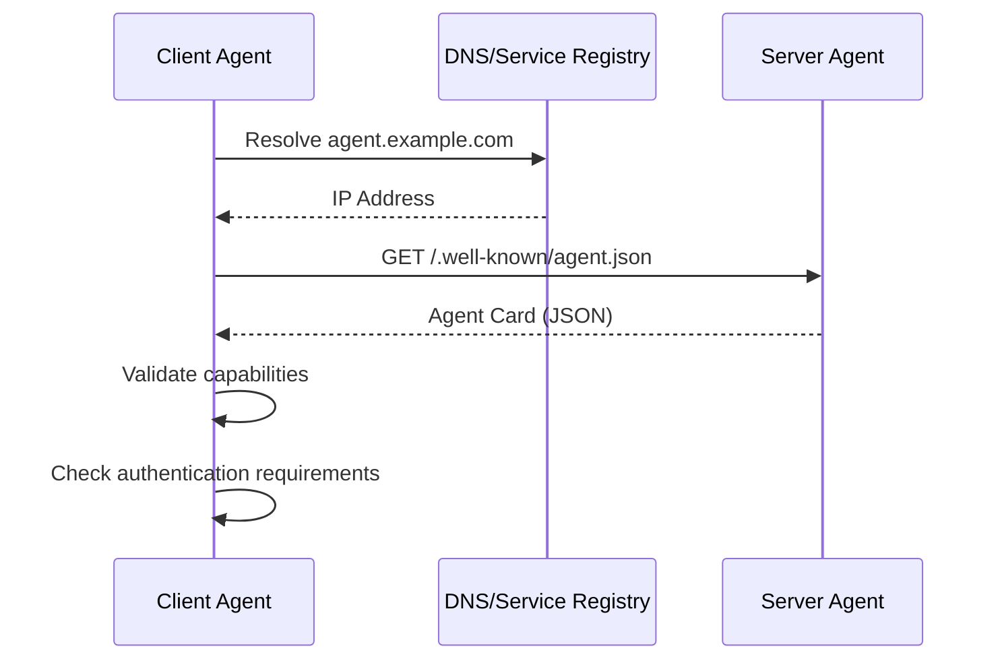
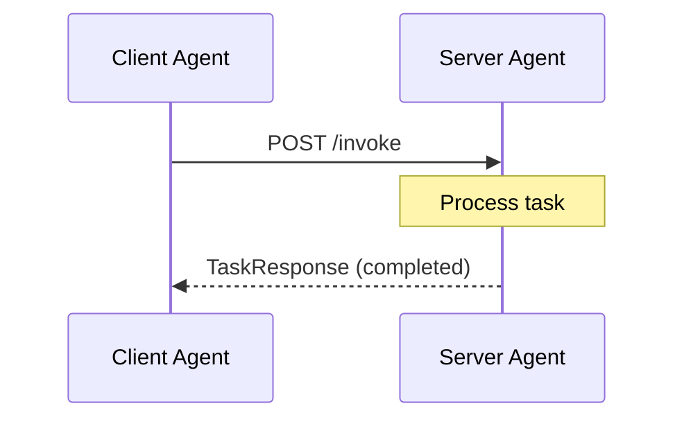
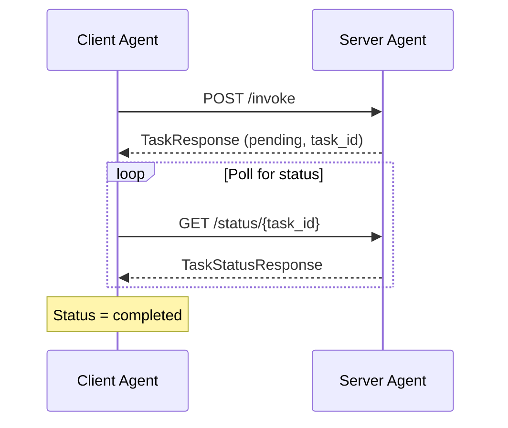
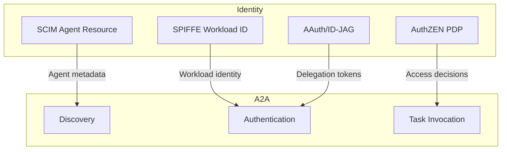

# A2A Protocol Overview

A2A (Agent-to-Agent) is a protocol for AI agent discovery, authentication, and task delegation based on the [Google A2A Protocol](https://google.github.io/A2A/).

!!! warning "Experimental"
    This package implements a draft specification that is subject to change.

## What is A2A?

A2A enables AI agents to discover, authenticate with, and delegate tasks to other agents. It provides a standardized way for agents to advertise their capabilities and for client agents to invoke those capabilities.

```mermaid
flowchart LR
    subgraph Client
        CA[Client Agent]
    end

    subgraph Discovery
        WK[/.well-known/agent.json]
    end

    subgraph Server
        SA[Server Agent]
        CAP[Capabilities]
    end

    CA -->|1. Discover| WK
    WK -->|2. Agent Card| CA
    CA -->|3. Invoke Capability| SA
    SA -->|4. Execute| CAP
    CAP -->|5. Result| SA
    SA -->|6. Task Response| CA
```

## Key Concepts

### Agent Card

The Agent Card is a JSON document that describes an agent's identity, capabilities, and endpoints:

```json
{
  "id": "code-review-agent",
  "name": "Code Review Agent",
  "description": "Reviews code for security and best practices",
  "version": "1.0.0",
  "capabilities": [
    {
      "id": "security-scan",
      "name": "Security Scan",
      "description": "Scans code for security vulnerabilities",
      "input_schema": { ... },
      "output_schema": { ... }
    }
  ],
  "authentication": {
    "type": "bearer",
    "token_endpoint": "https://auth.example.com/token"
  },
  "endpoints": {
    "invoke": "https://agent.example.com/invoke",
    "status": "https://agent.example.com/status/{task_id}",
    "cancel": "https://agent.example.com/cancel/{task_id}"
  }
}
```

### Capabilities

Capabilities define what an agent can do:

```go
capability := a2a.Capability{
    ID:          "security-scan",
    Name:        "Security Scan",
    Description: "Scans code for security vulnerabilities",
    InputSchema: json.RawMessage(`{
        "type": "object",
        "properties": {
            "repository": {"type": "string"},
            "branch": {"type": "string"}
        }
    }`),
}
```

### Task Lifecycle

Tasks progress through these states:



| Status | Description |
|--------|-------------|
| `pending` | Task accepted, waiting to start |
| `running` | Task is being processed |
| `completed` | Task finished successfully |
| `failed` | Task encountered an error |
| `canceled` | Task was canceled |

### Task Request

```json
{
  "capability_id": "security-scan",
  "input": {
    "repository": "acme/backend",
    "branch": "main"
  },
  "context": {
    "delegator": "user:alice",
    "mission": "pr-review:123"
  }
}
```

### Task Response

```json
{
  "task_id": "task-abc123",
  "status": "completed",
  "output": {
    "vulnerabilities": 0,
    "warnings": 3,
    "report_url": "https://..."
  }
}
```

## Discovery

Agents publish their Agent Card at a well-known URL:

```
https://agent.example.com/.well-known/agent.json
```

### Discovery Flow



## Authentication

A2A supports multiple authentication methods:

### Bearer Token

```go
client, _ := a2a.NewClient(card,
    a2a.WithClientBearerToken("your-access-token"),
)
```

### Delegation Token

For agent-to-agent delegation with human authority:

```go
delegationToken := &a2a.DelegationToken{
    Token:     "delegation-jwt",
    TokenType: "Bearer",
    ExpiresIn: 3600,
    Scope:     "security-scan code-review",
}

client, _ := a2a.NewClient(card,
    a2a.WithDelegationToken(delegationToken),
)
```

### mTLS

For workload identity authentication:

```go
client, _ := a2a.NewClient(card,
    a2a.WithClientHTTPClient(mtlsClient),
)
```

## Task Invocation

### Synchronous Invocation

For quick tasks that complete immediately:



### Asynchronous Invocation

For long-running tasks:



## Helper Functions

### Check Capabilities

```go
// Check if agent has a capability
if a2a.HasCapability(card, "security-scan") {
    // Agent supports security scanning
}

// Get capability details
cap := a2a.GetCapability(card, "security-scan")
if cap != nil {
    log.Printf("Found: %s - %s", cap.Name, cap.Description)
}
```

### Check Authentication

```go
// Check authentication requirements
if a2a.SupportsAuthentication(card, "bearer") {
    // Use bearer token auth
}

if a2a.SupportsAuthentication(card, "none") {
    // No authentication required
}
```

### Check Task Status

```go
status := resp.Status

if status.IsTerminal() {
    // Task is done (completed, failed, or canceled)
}
```

## Error Handling

```go
import "errors"

// Standard errors
if errors.Is(err, a2a.ErrAgentNotFound) {
    log.Println("Agent not found at the given URL")
}

if errors.Is(err, a2a.ErrCapabilityNotFound) {
    log.Println("Agent doesn't support this capability")
}

if errors.Is(err, a2a.ErrUnauthorized) {
    log.Println("Authentication required or token expired")
}

if errors.Is(err, a2a.ErrForbidden) {
    log.Println("Insufficient permissions")
}

if errors.Is(err, a2a.ErrRateLimited) {
    log.Println("Rate limit exceeded, retry later")
}
```

## Integration with Identity Stack

A2A integrates with the agent identity stack:



## Next Steps

- [Getting Started](getting-started.md) - Quick start guide
- [API Reference](https://pkg.go.dev/github.com/aistandardsio/agent-protocols/a2a) - Full Go package documentation

## References

- [Google A2A Protocol](https://google.github.io/A2A/) - Specification
- [A2A GitHub](https://github.com/google/A2A) - Reference implementation
