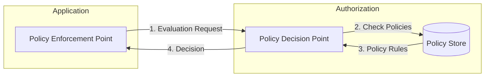
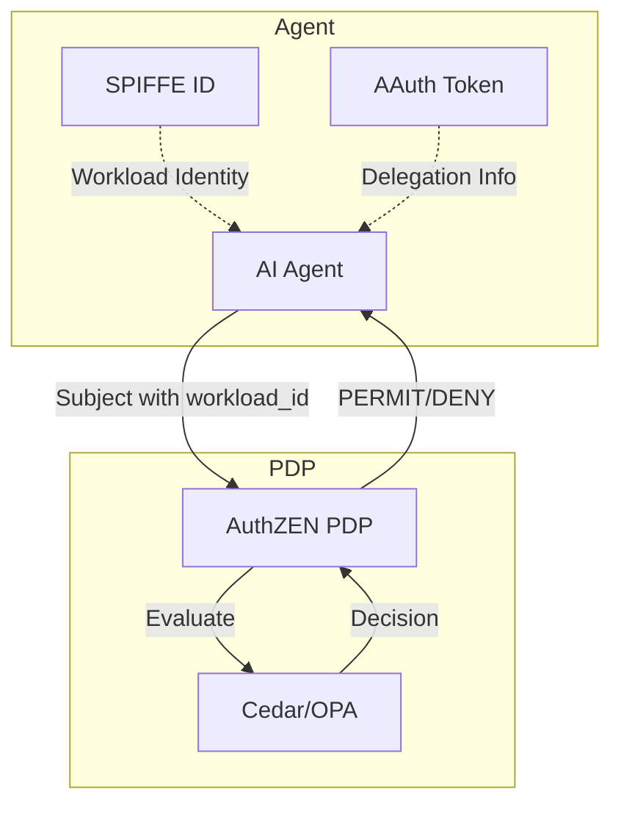

# AuthZEN Overview

AuthZEN is a standardized API for communication between Policy Enforcement Points (PEPs) and Policy Decision Points (PDPs) based on the [OpenID AuthZEN](https://openid.github.io/authzen/) specification.

!!! warning "Experimental"
    This package implements a draft specification that is subject to change.

## What is AuthZEN?

AuthZEN defines a standard REST API for authorization decisions, enabling interoperability between different authorization systems. It allows applications to query any compliant PDP for access decisions using a consistent interface.



## Key Concepts

### Subject

The entity requesting access (user, agent, service):

```go
subject := authzen.AgentSubject("code-review-agent",
    authzen.WithWorkloadID("spiffe://example.com/agent/code-review"),
    authzen.WithDelegator("user:alice"),
    authzen.WithCapabilities([]string{"code-review", "security-scan"}),
    authzen.WithMission("pr-review:123"),
)
```

### Resource

The protected resource being accessed:

```go
resource := authzen.NewResource("repository", "acme/backend", map[string]any{
    "visibility": "private",
    "owner":      "acme-corp",
})
```

### Action

The operation being requested:

```go
action := authzen.NewAction("read", map[string]any{
    "method": "GET",
    "path":   "/api/v1/code",
})
```

### Decision

The authorization result from the PDP:

| Decision | Meaning |
|----------|---------|
| `PERMIT` | Action is allowed |
| `DENY` | Action is denied |
| `INDETERMINATE` | PDP could not make a decision |
| `NOT_APPLICABLE` | No policies apply to this request |

## Evaluation API

### Single Evaluation

```json
POST /access/v1/evaluation

{
  "subject": {
    "type": "agent",
    "id": "code-review-agent",
    "properties": {
      "workload_id": "spiffe://example.com/agent/code-review",
      "delegator": "user:alice"
    }
  },
  "resource": {
    "type": "repository",
    "id": "acme/backend"
  },
  "action": {
    "name": "read"
  },
  "context": {
    "time": "2024-01-15T10:30:00Z"
  }
}
```

Response:

```json
{
  "decision": "PERMIT",
  "context": {
    "reason": "user alice has read access to acme/backend"
  }
}
```

### Batch Evaluation

For evaluating multiple requests in a single call:

```json
POST /access/v1/evaluations

{
  "evaluations": [
    { "subject": {...}, "resource": {...}, "action": {"name": "read"} },
    { "subject": {...}, "resource": {...}, "action": {"name": "write"} }
  ]
}
```

## Agent Identity Integration

The AuthZEN client is designed to work with the agent identity stack:



### Subject Properties for Agents

| Property | Description | Source |
|----------|-------------|--------|
| `workload_id` | SPIFFE ID of the workload | SPIFFE/WIMSE |
| `delegator` | Human who delegated authority | ID-JAG/AAuth |
| `capabilities` | Agent's declared capabilities | Agent Card |
| `mission` | Current task/mission scope | AAuth mission claim |

## Compatible PDPs

AuthZEN works with any compliant Policy Decision Point:

| PDP | Policy Language | Notes |
|-----|-----------------|-------|
| [Cedar](https://www.cedarpolicy.com/) | Cedar | AWS-backed, ABAC focus |
| [OpenFGA](https://openfga.dev/) | DSL | Relationship-based (ReBAC) |
| [OPA](https://www.openpolicyagent.org/) | Rego | General-purpose |
| [Topaz](https://www.topaz.sh/) | OPA + Directory | Combines Rego with relationships |
| [SpiceDB](https://authzed.com/spicedb) | Schema + Relationships | Google Zanzibar-inspired |

## Error Handling

```go
resp, err := client.Evaluate(ctx, req)
if err != nil {
    var authzErr *authzen.ErrorResponse
    if errors.As(err, &authzErr) {
        // Handle AuthZEN error
        log.Printf("AuthZEN error: %s - %s", authzErr.Code, authzErr.Description)
    }
    return err
}
```

## Next Steps

- [Getting Started](getting-started.md) - Quick start guide
- [API Reference](https://pkg.go.dev/github.com/aistandardsio/agent-protocols/authzen) - Full Go package documentation

## References

- [OpenID AuthZEN](https://openid.github.io/authzen/) - Specification
- [AuthZEN Interop](https://authzen.io/) - Interoperability testing
- [Cedar Policy](https://www.cedarpolicy.com/) - Cedar policy language
- [OpenFGA](https://openfga.dev/) - Relationship-based authorization
